# `just a man...`

`hey, 👋 i’m david, a tech enthusiast and computer science student|hobbyist with an insatiable curiosity for how things work. i’m all about building systems that don’t just function but make sense, and most importantly, spark joy in every little moment along the way... whether I’m refining logic, crafting experiences, or unraveling layers of complex systems, i approach every challenge with care, intention, and a deep desire to truly understand what lies beneath the surface. (i use arch btw :D ...)`

  
   
  

